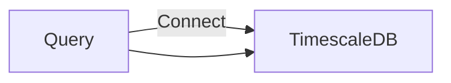

command line tool for benchmarking SELECT query performance across multiple **workers/clients** against a timescaledb instance.

constraints

- The tool should gracefully handle files that are **larger** than the one given,
  and should not wait to start processing queries until all input is consumed.
- Each query should then be executed by one of the concurrent workers your tool creates, with
  the constraint that queries for the same hostname be executed by the same worker each time.
  - each worker can execute from multiple hostnames.
    - hostname -> worker mapping needed
- Handles any invalid input appropriately.

optional funcitonality

- Handle CSV as either STDIN or via a flag with the filename.
- Unit / functional tests.
- Provides additional benchmark statistics that you think are interesting (be prepared to
  explain why, don’t just dump a bunch of numbers on the user).

initiate the cli with
CONNECTION_STRING={} ./benchmark --workers X --file ""

approach

1. print all csv rows to stdout
1. execute query against all rows
1. worker pool
